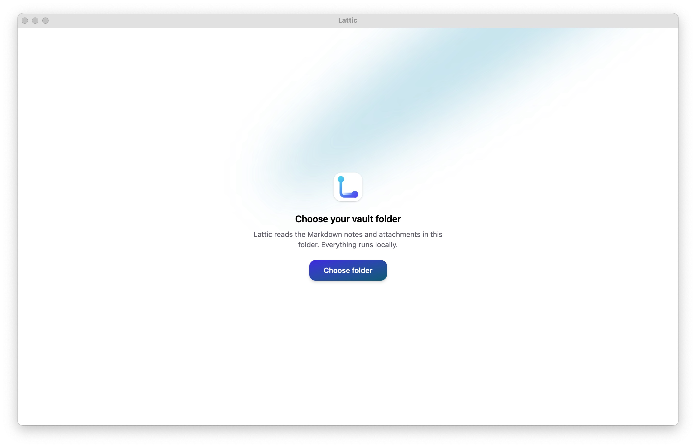

# Lattic

> 一個讀取 Obsidian vault、完全在本機運行 AI 的桌面 wiki。

Lattic 是一個 Electron 桌面應用，把你的 Obsidian 筆記庫（vault）變成可閱讀、可語意搜尋、可問答、可交辦任務的知識工作站。所有 AI 能力——向量搜尋、RAG 問答、agent 操作——都透過本機的 [Ollama](https://ollama.com) 運行，**筆記內容不會離開你的電腦**。



---

## 下載

到 **[Releases](https://github.com/Tim0124/lattic/releases/latest)** 下載最新版安裝檔：

| 平台                            | 檔案                   |
| ------------------------------- | ---------------------- |
| macOS（Apple Silicon）          | `Lattic-<version>.dmg` |
| macOS（Intel）/ Windows / Linux | 後續版本由 CI 自動產出 |

> **此 app 未做 code signing。** macOS 下載後會被標記為「已損毀」，需先在終端機移除 quarantine 才能開啟：
>
> ```bash
> xattr -cr /Applications/Lattic.app
> ```
>
> Windows 若被 SmartScreen 攔下，點「更多資訊 → 仍要執行」。
>
> 需先安裝並運行 [Ollama](https://ollama.com)，詳見下方[安裝與設定](#安裝與設定)。想自行從原始碼建置的話也參考該節。

---

## 主要功能

- **Vault 瀏覽** — 依資料夾結構呈現筆記樹，支援 Obsidian 的 `[[wikilink]]`、內嵌圖片、frontmatter。檔案變動即時反映（你在 Obsidian 編輯存檔，這邊自動刷新）。
- **圖片與 HTML 檢視** — 圖片支援縮放/平移，HTML 檔以隔離的 sandbox iframe 直接 render。
- **語意搜尋** — 用 `bge-m3` 對筆記建立向量索引，以語意（而非關鍵字）找出最相關的段落。
- **RAG 問答** — 提問時先檢索相關筆記片段，再交給 `gemma4:e4b` 串流生成答案，並標註引用來源、可點擊跳轉。
- **Agent 操作** — 交辦任務（如「整理所有提到 RAG 的筆記，寫一篇總覽」），模型會自主呼叫工具搜尋、閱讀、撰寫筆記。**寫入筆記前一律需要你在 UI 確認。**
- **介面與主題** — 三欄可拖拉 layout（導覽 / 閱讀 / AI）、雙色主題系統（4 組配色）、亮/暗/跟隨系統三種外觀。

---

## 技術架構

| 層       | 技術                                                         |
| -------- | ------------------------------------------------------------ |
| 桌面框架 | Electron 39 + [electron-vite](https://electron-vite.org)     |
| 前端     | React 19、TypeScript、Vite 7、Tailwind CSS v4                |
| UI       | Aceternity UI、motion、lucide-react、react-resizable-panels  |
| 資料層   | TanStack Query（renderer）、IPC bridge（main ↔ renderer）    |
| 本機 AI  | Ollama — `gemma4:e4b`（問答 / agent）、`bge-m3`（embedding） |
| Markdown | react-markdown + remark-gfm、gray-matter                     |
| 檔案監看 | chokidar                                                     |

### Process 分工

- **Main process**：vault 掃描與檔案監看、向量索引、與 Ollama 的 HTTP 通訊、agent loop、`vault://` 附件協議。
- **Renderer**：純 UI，透過 preload bridge 以 IPC 取得資料；AI 回覆以 IPC event 串流推送。
- 維持 `contextIsolation`，renderer 不直接接觸檔案系統與網路。

---

## 系統需求

- **macOS / Windows / Linux**（主要在 macOS 上開發測試）
- **Node.js** 20.19+ 或 22.12+（Vite 7 需求）
- **[Ollama](https://ollama.com)** 已安裝並運行
- 約 **11 GB** 磁碟空間給兩個模型；建議 16 GB 以上 RAM

---

## 安裝與設定

### 1. 安裝並啟動 Ollama

```bash
# 安裝（macOS）
brew install ollama

# 啟動服務（預設監聽 http://localhost:11434）
ollama serve

# 拉取所需模型
ollama pull gemma4:e4b   # 問答與 agent（約 9.6 GB）
ollama pull bge-m3       # 向量 embedding（約 1.2 GB）
```

> Lattic 連線到「已在運行」的本機 Ollama，並不會內嵌或自動安裝它。啟動 app 前請確認 Ollama 正在運行。

### 2. 安裝專案

```bash
git clone https://github.com/Tim0124/lattic.git
cd lattic
npm install
```

### 3. 設定 vault 路徑

首次啟動會使用內建的預設 vault 路徑。你可以在 **設定（左上角齒輪）→ Vault 資料夾 → 變更** 選擇自己的 Obsidian vault；切換後會自動重新掃描並建立索引。

> 預設路徑目前寫死在 `src/main/config.ts`，若你的 vault 在別處，啟動後從設定頁更換即可（選擇會被記住）。

---

## 開發

```bash
npm run dev          # 啟動開發模式（HMR）
npm run typecheck    # TypeScript 型別檢查
npm run lint         # ESLint
npm run format       # Prettier
```

## 打包

```bash
npm run build:mac    # macOS（產出 .app / .dmg / .zip 於 dist/）
npm run build:win    # Windows
npm run build:linux  # Linux
```

> macOS 打包未做 code signing。自用情況下從 Finder 開啟即可；若 Gatekeeper 阻擋，用右鍵 → 開啟。

---

## 使用說明

1. **閱讀筆記**：從左欄筆記樹點選，或用頂部搜尋框做語意搜尋後點結果。
2. **語意搜尋**：在左欄搜尋框輸入問題式的描述（不只是關鍵字），Enter 搜尋。
3. **問答**：開右欄「問答」分頁，提問後會先檢索筆記再串流回答，下方顯示引用來源。
4. **Agent**：開右欄「Agent」分頁交辦任務。模型會逐步呼叫工具，需要寫入筆記時會跳出確認卡，按「同意寫入」才會真的動到 vault。
5. **主題**：左上齒輪開設定，可換配色與亮/暗模式。

---

## 專案結構

```
src/
├── main/                 # Electron main process
│   ├── index.ts          # 進入點、視窗、IPC 註冊、vault:// 協議
│   ├── vault.ts          # vault 掃描、檔案監看、讀寫、路徑安全
│   ├── indexer.ts        # 向量索引（chunking、embedding、cosine 搜尋）
│   ├── ollama.ts         # Ollama API（embed / chat）
│   ├── chat.ts           # RAG 問答（檢索 + 串流生成）
│   ├── agent.ts          # Agent tool loop（JSON 協議、寫入確認）
│   └── config.ts         # 設定持久化（vault 路徑）
├── preload/              # contextBridge API
├── share/                # main 與 renderer 共用型別
└── renderer/src/
    ├── App.tsx           # 三欄 layout
    ├── components/       # NoteTree / NoteView / MediaView / SearchBar
    │                     # ChatPanel / AgentPanel / SettingsDialog
    └── lib/              # queries（TanStack Query）、theme、wikilink、utils
```

---

## 運作原理

- **索引**：啟動時掃描 vault，將每篇 markdown 依 heading 切成 chunk（過長段落再以滑動視窗細切），用 `bge-m3` 取得向量、normalize 後存成 flat index（`userData/vector-index.json`）。每篇筆記記錄 content hash，檔案變動時只重新 embed 有變的部分。
- **搜尋**：查詢向量化後，對所有 chunk 做 cosine 相似度（brute-force，筆記規模下為毫秒級），取 top-k。
- **問答**：取最新問題檢索 top-k chunk 作為 context，連同 system prompt 送進 `gemma4:e4b` 串流生成。
- **Agent**：採 prompt-based JSON 協議（每回合輸出一個 `{"tool": ...}` 或 `{"final": ...}`），可用工具為 `search_notes` / `list_notes` / `read_note` / `write_note`，上限 10 步；`write_note` 一律經過 UI 人工確認。

---

## 已知限制

- 向量索引只涵蓋 markdown 筆記；圖片、HTML、PDF 等不會被搜尋或問答引用。
- `![[筆記]]` transclusion 僅支援單層內嵌（被嵌入的筆記內若再有 transclusion 不會繼續展開）。

---

## License

[MIT](LICENSE) © Tim Kao
